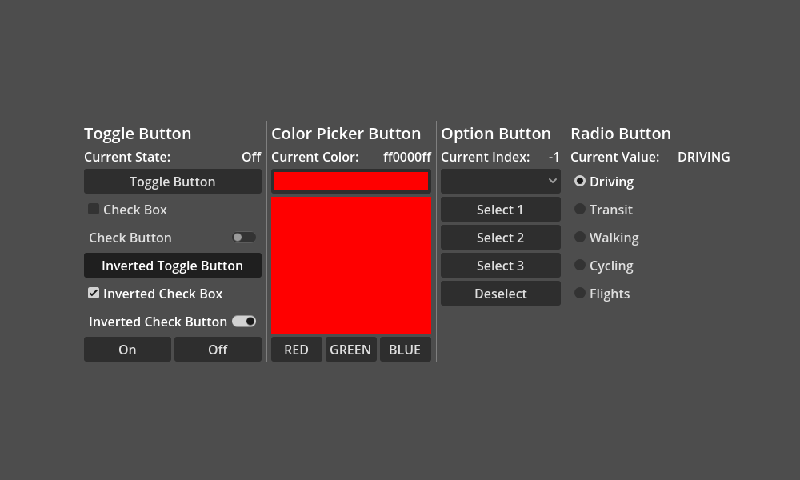
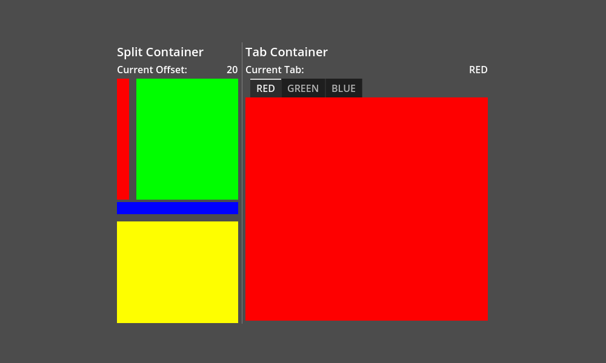
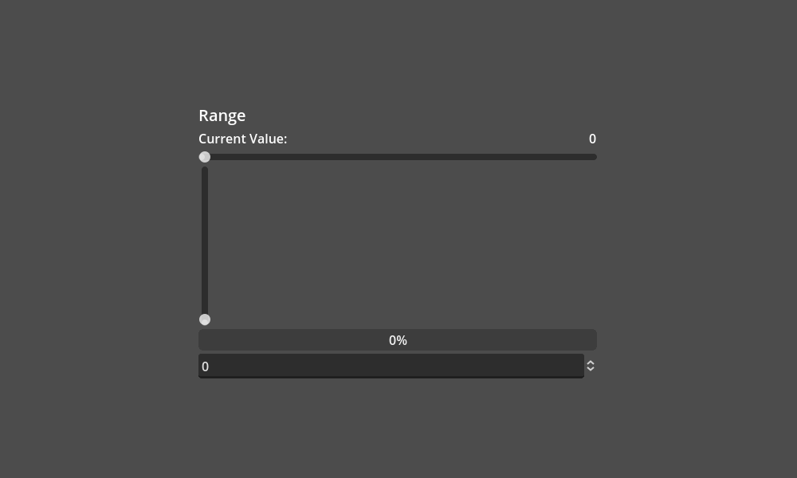

# GD Data Binding

GD Data Binding is a Godot library that simplifies your UI coding by automatically syncing data between views and models.

[Godot Asset Library](https://godotengine.org/asset-library/asset/3423)

## Demo

You can try it [here](https://hotaritobu.github.io/gd-data-binding/).







## Example

See the usage in [`examples`](examples).

## MVVM

GD Data Binding is based on the **MVVM** pattern.
In the pattern, the application UI and logic are separated into three components: *View*, *ViewModel*, and *Model*.

```mermaid
graph LR
  A(View)
  B(ViewModel)
  C(Model)
  A -- Data Binding --> B
  B -- Update --> C
  C -- Notify --> B
  B -- Notify --> A
```

Reference: https://learn.microsoft.com/dotnet/architecture/maui/mvvm

GD Data Binding hides implementation between *View* and *ViewModel*.
Therefore, all you need is to define how to **bind** *View* and data, and you don't need to care about syncing them.

For example, imagine to create a counter.
The view has a label to show the counted number and a button to count up the number.


The basic way to update the label content is that the button-pressed handler increases the count value and assigns it to the `text` of the label.

```gdscript
var _data = Data.new()


func _ready():
	_update_label_text()


func _on_button_pressed():
	_data.count += 1
	_update_label_text()


func _update_label_text():
	$Label.text = "Count: %s" % _data.count


class Data:
	var count: int = 0
```

However, in this way, you must know that `count` is the content of `$Label` and update `$Label.text` when updating `count`.

Using GD Data Binding, the code can be rewritten like this;

```gdscript
var _data = BindingSource.new(Data.new())


func _ready():
	_data.bind(&"count").using(_get_label).to_label($Label)


func _on_button_pressed():
	_data.count += 1


static func _get_label(count: int):
	return "Count: %s" % count


class Data:
	var count: int = 0
```

`BindingSource` wraps data objects and provides binding functions.

In `_ready`, bind `count` and `$Label.text`.
To convert the count value into the label content (e.g. `count = 5` -> "Count: 5"), use `_get_label`.

In `_on_button_pressed`, only increase `count`, but not update `$Label.text` directly.

In the view of the MVVM pattern:

- *View*: `_ready`, `_get_label`
- *ViewModel*: `_on_button_pressed`
- *Model*: `Data`

The important point is that you can be unaware of *View* when defining *ViewModel*.
